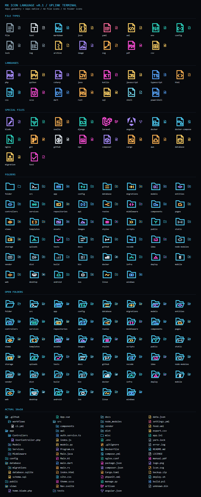

<p align="center">
  
</p>

<h1 align="center">MX Y2K Techno Noir</h1>

<p align="center">
  A dark VS Code color theme and a matching file icon theme with a<br>
  Y2K techno-noir look, borrowed from early-2000s hacker workstations.
</p>

<p align="center">
  
  
  
  
</p>

<p align="center">
  <a href="#whats-inside">What's inside</a> ·
  <a href="#install">Install</a> ·
  <a href="#color-theme">Color theme</a> ·
  <a href="#icons">Icons</a> ·
  <a href="#development">Development</a>
</p>

<p align="center">
  
</p>

## What's inside

One extension, two themes. You can use them together or on their own.

| Theme | What it is | Where to enable it |
|---|---|---|
| **MX Y2K Techno Noir** | Dark color theme for the editor and the whole workbench | **Preferences: Color Theme** |
| **MX Y2K Terminal Icons** | 48 file icons and 92 folder icons | **Preferences: File Icon Theme** |

## Install

Open the Extensions view in VS Code, search for **MX Y2K Techno Noir** and click **Install**. Or from a terminal:

```sh
code --install-extension maxontorres.mx-y2k-techno-noir
```

Then, from the Command Palette:

1. Run **Preferences: Color Theme** and pick **MX Y2K Techno Noir**.
2. Run **Preferences: File Icon Theme** and pick **MX Y2K Terminal Icons**.

### Build from source

You need Node.js and VS Code 1.85 or newer.

```sh
git clone https://github.com/maxontorres/vscode-y2k-techno-noir-theme.git
cd vscode-y2k-techno-noir-theme
npm run package
code --install-extension mx-y2k-techno-noir-1.1.0.vsix
```

## Color theme

A near-black workspace with cyan operational accents. The UI is dense and technical, with restrained contrast. The references are Uplink, ENCOM-style interfaces, Windows 2000-era software and cold industrial cyber-ops screens.

| | Hex | Used for |
|---|---|---|
|  | `#07090D` | Editor background |
|  | `#E6EDF3` | Editor foreground |
|  | `#4CC9F0` | Functions, tags, focus accents |
|  | `#FF4FD8` | Keywords, cursor |
|  | `#FFD166` | Constants, operators, attributes |
|  | `#FFB454` | Strings |
|  | `#A78BFA` | Types, classes |
|  | `#2DD4BF` | Parameters, inline code |
|  | `#718FA3` | Comments |

## Icons

The icon set is drawn like the glyphs of an early-2000s network workstation: sharp outlines, compact shapes and a restrained palette, all on a transparent background. Every icon is designed at 16px, the size VS Code actually renders. Shape carries the identity as much as color does, so icons stay distinguishable when two of them share a hue.

**File icons follow the file type.** The extension picks the language or data format. A file name only overrides it in two cases:

- the file is a tool manifest or config: `package.json`, `composer.json`, `Cargo.toml`, `Dockerfile`, `nginx.conf`
- the file is a framework's own entry point: `manage.py`, `artisan`, `angular.json`

So `UserController.php` gets the PHP icon and `auth.service.ts` gets the TypeScript icon, whatever framework the project uses.

**Folder icons follow the role of the directory.** `src`, `config`, `migrations`, `tests` and the rest share one folder outline with a small glyph inside, and each has an open variant.

## Development

Open this folder in VS Code and press `F5` to launch an Extension Development Host with both themes loaded.

| Command | What it does |
|---|---|
| `npm run build:icons` | Regenerates the SVG assets, the icon theme JSON and the review sheet |
| `npm run validate` | Checks both themes: color keys, SVG constraints, icon mappings |
| `npm run package` | Builds the VSIX |
| `npm run release` | Validates, then publishes to the Marketplace |

| Path | Contents |
|---|---|
| `themes/` | The color theme JSON |
| `icons/` | Generated SVGs and the icon theme JSON |
| `scripts/` | Icon generator and validator |
| `concepts/` | Review sheets, excluded from the VSIX |

Icons and their mappings are defined in `scripts/build-icons.mjs`. Edit that file, not the generated SVGs or `icons/mx-y2k-icon-theme.json`. To check your changes, open `concepts/uplink-icons-review.svg` at 100% and compare the enlarged geometry with the native 16px row.

## License

[MIT](LICENSE)
